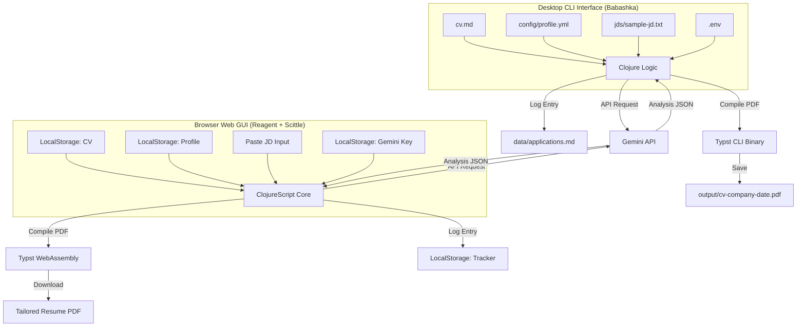

# Headhunter-Agent (Clojure/Babashka + Typst)

`headhunter-agent` is an open-source, lightweight, privacy-first job search assistant and resume compiler. It helps you evaluate job descriptions, track application history, and compile tailored ATS-optimized resumes either via a **Terminal CLI** or a **Stateless Web GUI**.

The system is built on **Clojure (compiled or interpreted via Babashka/Scittle)** and **Typst** for typesetting. It uses the Google Gemini API to analyze compatibility, match experience bullet points, and compile professional resumes without making up any facts (100% factual and evidence-based).

---

## Philosophy

* **Factual & Evidence-Based (No Hallucinations)**: Unlike tools that make up achievements or fake percentages to match a job description, this system restricts all resume modifications to facts present in your master resume (`cv.md`). It ensures that you can back up every claim with evidence.
* **Singapore Localization (SGT, SGD, FCF)**: Tailored for the Singapore job market:
  * Uses Singapore Dollar (SGD) compensation benchmarks and monthly base structures (including 13th month / AWS and variable bonuses).
  * Uses Singapore Timezone (`Asia/Singapore`) and localized date formats (`dd-MM-yyyy`).
  * Integrates Fair Consideration Framework (FCF) regulations and MyCareersFuture (MCF) listing guidelines into its legitimacy scoring.
* **Privacy by Design**: Your CV, profile details, and API keys are stored strictly on your machine (localStorage in the browser or local YAML/Markdown files on your desktop). Your private information never leaves your environment.

---

## System Architecture



---

## 🚀 Deployed Web GUI

For a frictionless experience without terminal setup, use the Web GUI. It is completely static, serverless, and runs directly in the browser:

👉 **Web URL**: [https://nurazhardotcom.github.io/headhunter-agent/](https://nurazhardotcom.github.io/headhunter-agent/)

### How it works:
1. **Stateless Runtime**: Built in ClojureScript Reagent and interpreted dynamically in-browser via **Scittle** (meaning zero Node compilation or build-tool overhead).
2. **Local Storage**: Your Gemini API Key, CV, and profile data are saved only inside your browser's private `localStorage`.
3. **In-Browser Typst Compilation**: Uses **Typst WebAssembly** (`typst.ts`) to render and compile ATS-friendly PDF resumes directly in the browser tab.

---

## 💻 Desktop CLI Installation & Setup

### 1. Installation

Clone the repository and run the setup script for your operating system:

* **Linux / macOS**:
  ```bash
  chmod +x setup.sh
  ./setup.sh
  ```
* **Windows**:
  Double-click `setup.bat` (or run it via CMD/PowerShell).

The setup script checks for and automatically installs **Babashka** and **Typst** if they are missing from your system, sets up a `.env` template, and copies configuration example templates.

### 2. Configuration
1. **API Key**: Get a free Gemini API key from [Google AI Studio](https://aistudio.google.com/apikey) and add it to your `.env` file:
   ```env
   GEMINI_API_KEY=your_actual_key_here
   ```
2. **Resume & Profile**:
   * Customize `cv.md` with your master resume.
   * Customize `config/profile.yml` with your contact details, targets, monthly base salary expectations, AWS eligibility, and National Service status.
   * Customize `modes/_profile.md` with your target role archetypes and narrative context.

---

## 🛠 CLI Usage Reference

### 1. Evaluate a Job Description
Analyze a JD against your resume to check for fit, gaps, salary alignment, and interview stories.
```bash
# Evaluate JD from a text file
bb evaluate --file jds/sample-jd.txt

# Or evaluate by passing raw text
bb evaluate "Job Description text here..."
```
This generates a detailed evaluation report under `reports/` and logs the entry to the applications tracker.

### 2. Tailor and Compile a Resume PDF
Tailor your professional summary and experience bullets dynamically to match the JD, and compile a PDF.
```bash
bb pdf "Company Name" --file jds/sample-jd.txt
```
This writes the tailored resume data to `resume_data.json`, compiles a PDF to the `output/` directory, and marks the tracker row with a checkmark (`✅`).

### 3. Manage Application Tracker
Quickly review your active job search pipeline.
```bash
# List all tracked applications
bb tracker list

# Manually mark a specific application ID as PDF Ready
bb tracker mark <id>
```

---

## 📄 Data Contract

To make upstream updates safe and preserve your personal data, the project is structured under a strict **Data Contract** (see [DATA_CONTRACT.md](DATA_CONTRACT.md)):

* **User Layer (Never modified by git updates)**:
  * `.env`, `cv.md`
  * `config/profile.yml`, `modes/_profile.md`
  * `data/applications.md`, `reports/`, `output/`, `jds/`
* **System Layer (Safe to update/overwrite)**:
  * `src/`, `bb.edn`, `resume.typ`, `resume_template.typ`
  * `setup.sh`, `setup.bat`, `README.md`
